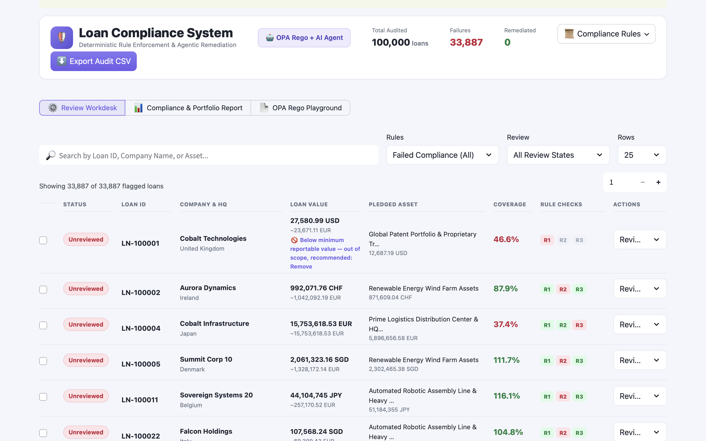
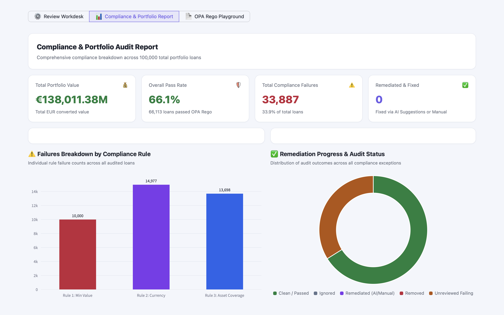
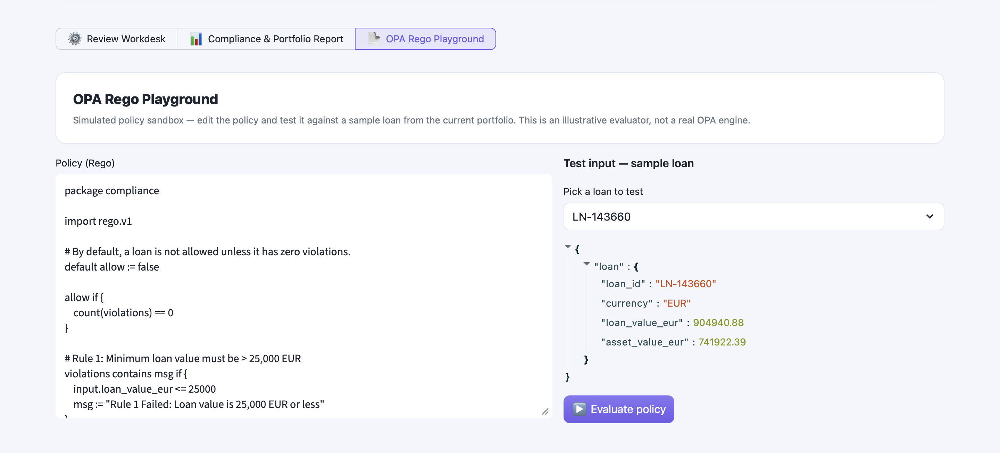

# Loan Compliance System

A **Deterministic Rule Enforcement & Agentic Remediation** demo for loan
portfolio compliance, combining:

- A **Go pipeline** ([pipeline/main.go](pipeline/main.go)) that reads a loan
  portfolio, converts currencies to EUR, and checks every loan against a
  policy engine.
- **Open Policy Agent (OPA)** evaluating three deterministic rules written
  in Rego ([policy/compliance.rego](policy/compliance.rego)).
- An **AI collateral-suggestion agent** ([retrieval/](retrieval/)) — a
  LangChain + FAISS RAG pipeline over a company-reference document, backed
  by Azure OpenAI/OpenAI — that suggests an alternative pledged asset when a
  loan fails the asset-coverage rule. This is called **on-demand, one loan
  at a time, from the Streamlit UI** — never in bulk from the Go pipeline
  (`ENABLE_AI_SUGGESTIONS=false` by default) — so the deterministic pipeline
  stays fast even over 100,000 loans.
- A **Streamlit dashboard** ([app.py](app.py)) tying it all together for
  review: Review Workdesk, Compliance & Portfolio Report, an OPA Rego
  Playground, and an Asset Value Predictor.


The Streamlit app also runs standalone with **zero setup**, using a
synthetic 100,000-loan demo portfolio — see [Quickstart](#quickstart-demo-mode-zero-setup)
below.

## Table of contents

- [Project structure](#project-structure)
- [Quickstart (demo mode, zero setup)](#quickstart-demo-mode-zero-setup)
- [Using the app](#using-the-app)
- [Connecting your own data](#connecting-your-own-data)
- [Running the real full stack](#running-the-real-full-stack-go--opa--ai--streamlit)
- [Code layout (`app.py`)](#code-layout-apppy)
- [Code quality](#code-quality)
- [Changelog](#changelog)
- [Troubleshooting](#troubleshooting)
- [Notes](#notes)

## Project structure

```
.
├── app.py                    # Streamlit dashboard (the UI)
├── requirements.txt          # Python dependencies for app.py + retrieval/
├── .streamlit/config.toml    # Streamlit theme (accent colour, etc.)
├── .env.example              # Copy to .env and fill in AI provider credentials
├── docs/
│   └── architecture.png      # System architecture diagram
├── data/
│   ├── loans.csv              # Sample loan portfolio (input to the Go pipeline)
│   ├── company-reference.pdf  # Source document for the AI suggestion agent's FAISS index
│   └── compliance_report.json # Generated by the Go pipeline; read by app.py (git-ignored)
├── policy/
│   └── compliance.rego       # The 3 deterministic OPA rules
├── pipeline/
│   ├── go.mod
│   └── main.go               # Reads loans.csv, calls OPA + the suggestion API, writes the report
├── retrieval/                 # AI collateral-suggestion agent (Python package)
│   ├── ingest.py               # One-time: builds the FAISS index from company-reference.pdf
│   ├── retriever.py            # FAISS similarity search over the ingested company data
│   ├── suggestion_agent.py     # Picks + explains an alternative asset via chat LLM
│   ├── provider.py             # OpenAI / Azure OpenAI client setup (env-driven)
│   ├── api_server.py           # stdlib HTTP server exposing POST /suggest for the Go pipeline & UI
│   └── vector_store/
│       └── company_reference_faiss/  # Prebuilt FAISS index (index.faiss + index.pkl)
└── .github/workflows/go.yml  # CI: builds the Go pipeline
```

## Quickstart (demo mode, zero setup)

This is enough to see the full UI with a synthetic 100,000-loan portfolio —
no Go, no OPA, no AI credentials required.

1. Install Python 3.9+ if you don't already have it:
   https://www.python.org/downloads/ (on Windows, tick **"Add Python to
   PATH"** during install).
2. From the repo root:
   ```bash
   python3 -m venv .venv
   source .venv/bin/activate        # Windows: .venv\Scripts\activate
   pip install -r requirements.txt
   streamlit run app.py
   ```
3. Your browser should open automatically to `http://localhost:8501`. If
   `streamlit` isn't recognised as a command, run
   `python3 -m streamlit run app.py` instead.
4. To stop the app, go back to the terminal and press `Ctrl+C`.

See [Troubleshooting](#troubleshooting) if any of this doesn't work first try.

## Using the app

- **Review Workdesk** — searchable/filterable table of loans that failed
  compliance. Each row has a checkbox (for bulk actions) and a per-row
  **Actions** dropdown:
  - `✅ Remediate` / `🙈 Ignore` / `🗑️ Remove` — record a review decision.
  - `🤖 AI Suggest` (Rule 3 failures only) — calls the AI suggestion agent
    live for that one loan and shows the recommended alternative asset.
  - Rule 2 (currency mismatch) failures show an instant, non-AI
    **"💱 Fix: use `<expected>` instead of `<actual>`"** hint instead — a
    currency fix is a deterministic lookup, not something an asset-suggestion
    agent can help with.



- **Compliance & Portfolio Report** — portfolio-wide metric cards, a
  failures-by-rule bar chart, and a remediation-progress donut chart.


- **OPA Rego Playground** — an illustrative, in-app check against the policy
  text. It does **not** call a real OPA engine — clearly labelled as such.


## Connecting your own data

Everything defaults to a synthetic 100,000-loan demo portfolio
(`generate_demo_loans`, cached with `@st.cache_data`) so the app runs with
zero configuration. To use real data, change `DATA_SOURCE_MODE` near the top
of `app.py`:

```python
DATA_SOURCE_MODE = "demo"    # default — synthetic data, no setup needed
DATA_SOURCE_MODE = "csv"     # load CSV_DATA_PATH via load_data_from_csv()
DATA_SOURCE_MODE = "custom"  # calls load_data_from_custom_source() — reads
                              # data/compliance_report.json, written by the
                              # Go pipeline; see "Running the real full
                              # stack" below
```

Search `app.py` for **"DATA SOURCE ADAPTERS"** for the full picture. There
are four adapter functions, each documented with the exact DataFrame schema
every adapter must return:

| Function | Status | Purpose |
|---|---|---|
| `load_data_from_csv(csv_path)` | Works as-is | Load a CSV matching `EXPORT_COLUMNS`. |
| `load_data_from_custom_source()` | Works as-is | Reads `data/compliance_report.json` from the Go pipeline. |
| `load_data_from_pdf_vectors(pdf_folder_path)` | Placeholder — raises `NotImplementedError` | Extract structured loan records from PDFs via a vector store. |
| `load_data_from_llm_extraction(source_texts)` | Placeholder — raises `NotImplementedError` | Use an LLM to pull structured fields out of free text. |

Every adapter must return a `pandas.DataFrame` with the columns listed in
`EXPORT_COLUMNS` (also documented inline above each adapter). If your source
data doesn't already include the three rule-pass booleans, compute them the
same way `generate_demo_loans()` does — that block is intentionally kept
simple and copy-pasteable.

You can also import a CSV **while the app is running**: click "Import CSV"
in the header, and pick a file with the same columns as one you get from
"Export Audit CSV" (export once first to see the exact expected format).

## Running the real full stack (Go + OPA + AI + Streamlit)

This wires the previously separate pieces together so the Streamlit
dashboard shows real compliance results instead of synthetic demo data.
`DATA_SOURCE_MODE` in `app.py` should be `"custom"` for this (see above).

### 1. Start OPA with the compliance policy loaded

```bash
docker run -d --name opa -p 8181:8181 \
  openpolicyagent/opa:latest run --server --set=decision_logs.console=true

curl -X PUT --data-binary @policy/compliance.rego \
  http://localhost:8181/v1/policies/compliance
```

Verify it loaded correctly:

```bash
curl -s http://localhost:8181/v1/policies/compliance
```

> ⚠️ The policy ID in the URL (`compliance`) must match `package compliance`
> at the top of `compliance.rego`. Pushing it under a different policy ID
> while another policy already declares the same package causes a 400 error
> ("multiple default rules ... found").

### 2. Configure AI credentials (optional, but needed for `🤖 AI Suggest`)

```bash
cp .env.example .env
# then fill in either the Azure OpenAI or OpenAI section
```

Without a valid key, the rest of the pipeline still works — Rule 3 failures
just won't get an AI suggestion (the API returns an error, handled
gracefully everywhere it's called).

### 3. Start the collateral-suggestion API (Python), from the repo root

```bash
pip install -r requirements.txt
python3 -m retrieval.api_server
```

This serves `POST /suggest` on `http://127.0.0.1:8000`, called on-demand
from the Streamlit UI (via the `🤖 AI Suggest` row action) for loans that
fail Rule 3 (insufficient collateral).

### 4. Run the Go pipeline to process every loan in `data/loans.csv`

```bash
cd pipeline
go run main.go
```

This writes `data/compliance_report.json` — one record per loan, with each
rule's pass/fail result. It runs OPA checks only by default (fast — a few
seconds for 100,000 loans); it deliberately does **not** call the AI
suggestion API in bulk, since that would mean thousands of real LLM calls
(too slow for interactive use). AI suggestions are instead fetched one loan
at a time, on-demand, from the UI. Set `ENABLE_AI_SUGGESTIONS=true` as an
environment variable before running if you really want the old bulk
behaviour.

### 5. Run the Streamlit UI, from the repo root

```bash
streamlit run app.py
```

The Review Workdesk and Compliance Report will load
`data/compliance_report.json` automatically. If that file doesn't exist yet
(step 4 hasn't been run), the UI falls back to synthetic demo data with a
warning banner instead of crashing.

To go back to synthetic demo data at any time, set `DATA_SOURCE_MODE =
"demo"` near the top of `app.py`.

## Code layout (`app.py`)

The file is organised into numbered sections, top to bottom:

1. Page config
2. **Data source switch** (`DATA_SOURCE_MODE`) — see above
3. Domain constants (FX rates, rule thresholds, demo vocabulary)
4. Colour palette (`COLORS`)
5. CSS theme injection
6. Synthetic demo data generator (`generate_demo_loans`)
7. **Data source adapters** — see above
8. Formatting/HTML helper functions
9. Session state
10. Header
11. Review Workdesk
12. Compliance & Portfolio Report
13. OPA Rego Playground (illustrative only)
14. Asset Value Predictor (heuristic only, not a trained model)
15. `main()` — the lazy-nav switch; see [Changelog](#changelog) below

## Code quality

`app.py` has been run through:

```bash
pip install black flake8
black --line-length 110 app.py       # formatting
flake8 app.py                        # lint (config in .flake8)
```

Both currently pass clean. `.flake8` documents why the line-length limit is
slightly above the PEP 8 default (the file embeds CSS/HTML as Python
strings, and breaking those mid-rule hurts readability for no real benefit).

## Changelog

- **Section navigation uses `st.segmented_control()`, not `st.tabs()`.**
  `st.tabs()` renders every tab's code on every rerun (it only hides the
  inactive ones with CSS), which was noticeably slow once real data volumes
  were involved. `main()` instead reads the active segment from
  `st.segmented_control()` and calls only that section's `render_*()`
  function, so inactive sections never run.
- **Header/toolbar switched from fixed-ratio `st.columns()` to
  `st.container(horizontal=True, ...)`.** Fixed-ratio columns shrank but
  never wrapped, so on narrower windows the "OPA Rego + AI Agent" pill
  overlapped the stat chips next to it, and header buttons had their labels
  wrap letter-by-letter. The flex container wraps whole items onto a new
  line instead of shrinking them below their natural size. This requires
  `streamlit>=1.48` (horizontal flex containers were added in that version).
  Two related gotchas if you touch this layout again:
  - `st.container(..., gap=...)` only accepts the string literals `"small"`
    / `"medium"` / `"large"` / `"none"` in Streamlit 1.50, not a pixel
    integer.
  - A nested `st.container()` defaults its own width to `"stretch"` (100% of
    its parent) — that's what caused header buttons to be forced onto their
    own line even when there was room to spare. Keep buttons as direct
    children of the outer flex row, not wrapped in their own container.
- **AI suggestions are fetched on-demand, not pre-computed in bulk.** See
  step 4 above — this was a deliberate change after the bulk approach made
  the Go pipeline take 10+ minutes against a real Azure OpenAI deployment.
- **`.streamlit/config.toml`** sets `theme.primaryColor` etc. so Streamlit's
  own native widgets (checkboxes, the segmented-control nav, focus rings)
  match this app's indigo colour scheme instead of Streamlit's red default.
  These values are duplicated (deliberately) from the `COLORS` dict inside
  `app.py`, since this file can't import Python — if you change `COLORS`,
  update the matching values here too.

## Troubleshooting

- **`python is not recognised` / `command not found`**: Python isn't
  installed, or wasn't added to PATH — reinstall and tick the "Add Python to
  PATH" box on Windows.
- **`zsh: command not found: streamlit`** (Mac) or **`streamlit is not
  recognised`** (Windows): pip installed everything correctly, but the
  `streamlit` shortcut isn't on your terminal's PATH yet. Run
  `python3 -m streamlit run app.py` instead, or make sure your virtual
  environment is activated (you should see `(.venv)` at the start of your
  terminal prompt) before `pip install`.
- **Browser opens but the page is blank or shows an error**: check the
  terminal — Streamlit prints the exact error there, usually a missing
  package (`pip install -r requirements.txt` again) or a typo in `app.py`.
- **`Port 8501 is already in use`**: an earlier copy of the app is still
  running. Close that terminal, or run
  `streamlit run app.py --server.port 8502`.
- **`TypeError: ...() got an unexpected keyword argument ...`** mentioning a
  Streamlit function: your installed Streamlit version is older than the
  feature being used (see [Changelog](#changelog) — `streamlit>=1.48` is
  required). Run `pip install --upgrade streamlit` inside your activated
  virtual environment.
- **Go pipeline: `Failed to fetch exchange rates` / TLS errors**: check your
  network can reach `https://api.frankfurter.dev` — this is a live FX-rate
  API call, not something running locally.
- **Go pipeline seems to hang / takes a very long time**: make sure
  `ENABLE_AI_SUGGESTIONS` is **not** set to `true` (see step 4 above) — with
  it on, every Rule 3 failure makes a real LLM call, which does not scale to
  a full portfolio.
- **`🤖 AI Suggest` returns an error**: `retrieval/api_server.py` isn't
  running, or `.env` is missing/incomplete (see step 2 above). The Go
  pipeline and Streamlit UI both handle this gracefully rather than
  crashing — you'll just see the error message in place of a suggestion.

## Notes

- FX rates for the demo/CSV data paths are static values (`FX_RATES` in
  `app.py`); the real Go pipeline fetches live rates instead (see
  `fetchRates()` in `pipeline/main.go`).
- The OPA Rego Playground tab does **not** call a real OPA engine — it's an
  illustrative check against the policy text, clearly labelled as such in
  both the UI and the code's docstrings.
- The Asset Value Predictor tab is a heuristic over the generated/loaded
  data, **not** a trained ML model — also labelled as such.
- Remediated/Failures counters are live: resolving exceptions in the
  Workdesk updates the header and report tab immediately, while "Overall
  Pass Rate" stays fixed (it reflects the deterministic rule verdict, not
  remediation state).


